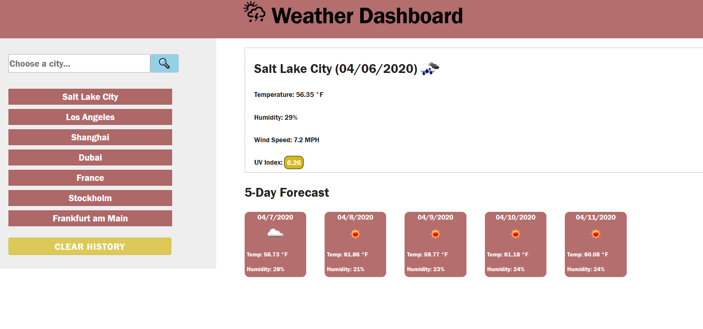

# Weather Dashboard

## Unit 06 Server-Side APIs
## April 6th, 2020

Deployed application: https://ajhami.github.io/weather_dashboard/

This repository contains the source files to a weather dashboard. Users can open this application and search for current weather conditions as well as a five-day forecast. A recent search history will be saved for the user to click on and pull up the weather data for that city.

The application utilizes APIs from openweathermap.org to gather desired weather information in real time. jQuery is utilized for simpler, more efficient JavaScript. Skeleton.css was used as a basic framework for the html layout and appearance.

© 2020 Alexander James Hamilton. All Rights Reserved.
